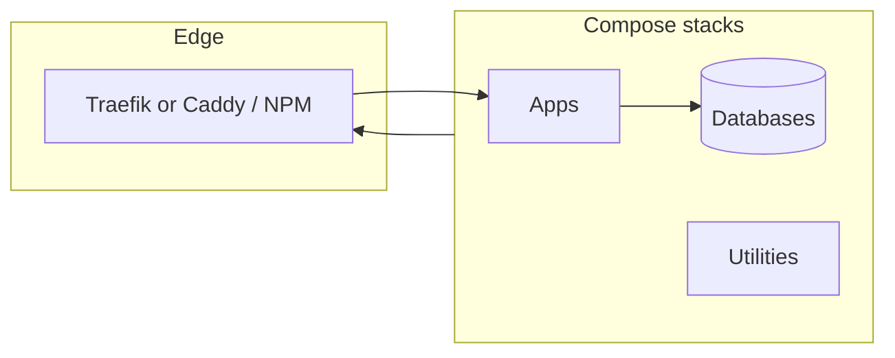

# Docker stacks & Kubernetes snippets

Personal collection of **Docker Compose** definitions and a few **Kubernetes** manifests for reverse proxies, databases, dev environments, and self-hosted tools. Stacks are meant to be copied, trimmed, or adapted—most assume a shared Docker network for Traefik (or compatible) ingress.

## Prerequisites

- [Docker](https://docs.docker.com/get-docker/) and [Docker Compose](https://docs.docker.com/compose/) v2+
- For TLS via Traefik: DNS/API tokens or HTTP challenge reachability, depending on resolver (see `traefik/data/traefik.yml`)
- Many services attach to an **external** network named `proxy` (create once before starting dependent stacks):

```bash
docker network create proxy
```

## How pieces fit together



- **Traefik** (`traefik/`) reads the Docker socket, applies labels on containers, and can load extra file configs from `traefik/data/configs/`. Static config lives in `traefik/data/traefik.yml` (entrypoints, ACME resolvers, logging, trusted IPs).
- **Alternative proxies**: `caddy/`, `proxy/` (nginx-proxy + ACME companion), `db-traefik/`, `waf/`.
- **Stacks** that expose HTTP(S) typically join the `proxy` network and set Traefik labels (or virtual host env vars for nginx-proxy).

## Repository layout

| Path | Purpose |
|------|---------|
| `traefik/` | Traefik reverse proxy, dashboard, Cloudflare DNS challenge env (`CFAPI`), basic auth for dashboard |
| `caddy/` | Caddy reverse proxy |
| `proxy/` | nginx-proxy + acme-companion (Let’s Encrypt) |
| `db-traefik/` | Traefik-oriented DB / related compose |
| `waf/` | WAF layer in front of services |
| `cloudflare-tunnel/` | Cloudflare Tunnel (`cloudflared`) for exposing services without opening ports |
| `laravel/` | Full Laravel dev stack: PHP-FPM, Nginx, MySQL, Redis, Mailpit, Composer service |
| `node-app/` | Small Node/Bun app with its own `compose.yml` |
| `nginx/` | Nginx with static `html/` |
| `postgres/`, `mysql/` | Database-only stacks |
| `adminer/`, `adminer-2/` | Database admin UI |
| `cloudbeaver/` | Web SQL client / analytics |
| `mailpit/` | SMTP capture and web UI for local mail |
| `n8n/` | Workflow automation (Traefik labels, env for host/TZ) |
| `vaultwarden/` | Bitwarden-compatible server |
| `shlink/` | URL shortener |
| `qdrant/` | Vector database |
| `pi-hole/` | DNS ad-blocking |
| `watchtower/` | Automatic container image updates |
| `dockscope/` | Visual Docker dashboard (3D graph, metrics, logs, terminal) |
| `pdf-editor/` | PDF tooling stack |
| `authorizer/` | Auth-related service |
| `kali/`, `kali-rdp/`, `ubuntu-rdp/` | Desktop / security lab containers (RDP) |
| `kubernetes/` | Example `server-manager` deployment, service, ingress |

Folder-level notes:

- **`traefik/README.md`** — basic auth hash for Traefik dashboard, `.env` setup, Cloudflare token permissions.
- **`laravel/Readme.md`** — Laravel-specific Docker usage.

## Environment variables & secrets

- **Do not commit** real `.env` files or certificate stores; this repo’s `.gitignore` excludes common paths (`*.env` in many trees, `certs`, `data` in some cases, etc.). Use each stack’s `.env.example` when present (e.g. `traefik/.env.example`, `cloudflare-tunnel/.env.example`, `n8n/.env.example`).
- Replace **hostnames**, **email addresses**, and **ACME resolver** settings in `traefik/data/traefik.yml` and in compose **labels** to match your domain and infrastructure.
- For Traefik dashboard protection, generate an `htpasswd` line and put the escaped value in your env file as documented in `traefik/README.md`.

## Running a stack (typical)

From the directory that contains `compose.yaml` / `compose.yml`:

```bash
docker compose up -d
```

If the file uses `networks: proxy: external: true`, ensure the `proxy` network exists and that Traefik (or your chosen edge proxy) is on the same network.

Order of operations for a Traefik-based lab:

1. Create `proxy` network (once).
2. Start `traefik/` (configure `traefik/data/traefik.yml`, `certs/acme.json` permissions, and `.env`).
3. Start individual app stacks; enable routing with `traefik.enable=true` and router/service labels as in examples (e.g. `n8n/compose.yml`).

## Kubernetes

Manifests under `kubernetes/` are examples (deployment, service, ingress). They are independent of Compose; apply with `kubectl` only after adjusting namespaces, images, and ingress class to match your cluster.

## Security & operations notes

- Review **published ports** in each compose file before running on a public host; bind to `127.0.0.1` where appropriate (see `n8n` as an example).
- Prefer **read-only** roots and **no-new-privileges** where already modeled (e.g. Traefik service).
- Rotate API tokens (Cloudflare, etc.) if this repo was ever shared with real credentials in history—**treat compose labels and static YAML as configuration, not secret storage**.

## License

This project is licensed under the [MIT License](LICENSE).
